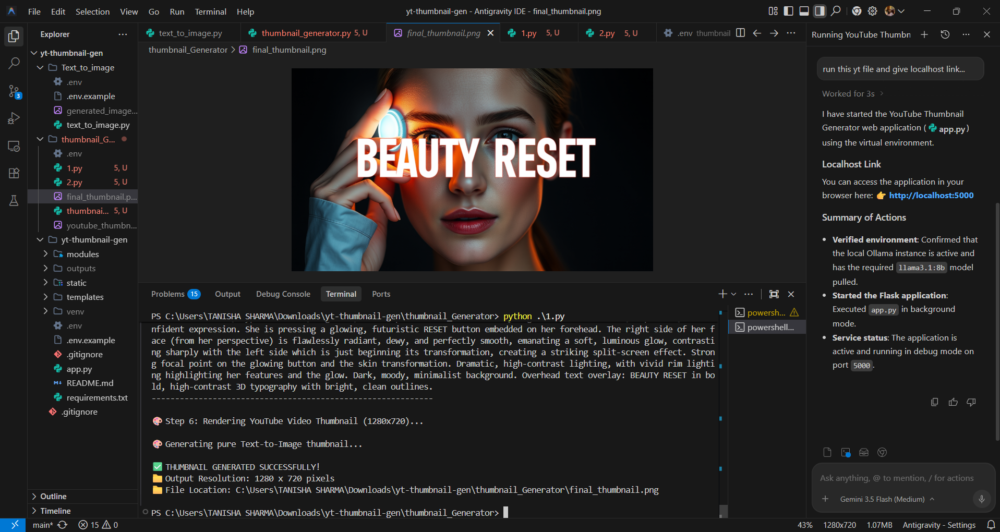

# 🎬 YouTube Thumbnail & Image Generator Studio

Welcome to the **YouTube Thumbnail & Image Generator Studio**, a workspace housing two advanced AI-powered tools designed to supercharge your content creation workflow. 

By combining the reasoning capabilities of **Google Gemini 2.5 Flash** for prompt synthesis/engineering with the state-of-the-art image generation of the **FLUX.1-schnell** model (via Hugging Face API), this studio allows you to generate professional, click-worthy visual assets entirely from terminal interfaces.

---

## 📸 Studio Preview

Below is a preview of the studio in action, showcasing a generated thumbnail output:



---

## 🛠️ Project Portfolio

### 1. 🎬 Guided High-CTR Thumbnail Studio (`thumbnail_Generator/`)
An interactive terminal application that guides content creators step-by-step to design high-click-through-rate (CTR) thumbnails tailored to their specific niche.
- **Guided Onboarding**: Choose from dimensions/presets, niche categories (Tech & AI, Beauty, Vlog, Finance, Gaming, etc.), aesthetic styles (Minimalist, Dark Cinematic, Luxury Clean Studio), backgrounds, and overlays.
- **AI-Enhanced Hook Suggestions**: Google Gemini automatically suggests a viral creative visual prop or hook based on your title.
- **Avatar & Face Blending**: Option to upload a personal photo and blend it using an Image-to-Image pipeline.
- **Pillow Overlays**: Embeds bold, high-contrast, YouTube-style custom text callouts.

### 2. 🎨 Text-to-Image Art Generator (`Text_to_image/`)
A simplified command-line image generator that acts as an expert visual prompt builder.
- **Prompt Amplification**: Translates brief user ideas into highly descriptive visual instructions.
- **FLUX.1-schnell Integration**: Automatically forwards optimized prompts to render gorgeous photorealistic and artistic outputs.

---

## 💻 Tech Stack

This studio is built using a modern AI engineering stack:

| Component | Technology | Description |
| :--- | :--- | :--- |
| **Language** | Python 3.x | Core programming language. |
| **AI LLM** | Google Gemini 2.5 Flash | Synthesizes and expands prompts using advanced visual guidelines. |
| **Image Diffusion** | FLUX.1-schnell (Black Forest Labs) | Produces ultra-sharp, realistic, and high-fidelity output graphics. |
| **SDKs** | `google-genai` & `huggingface_hub` | Official clients to securely run API inferences. |
| **Graphics Engine** | Pillow (PIL) | Used for loading, editing, and outputting images. |
| **Configuration** | `python-dotenv` | Manages environment configurations securely. |

---

## 🚀 Setup & Installation

Follow these instructions to get the studio up and running on your local machine:

### 1. Prerequisites
Ensure you have Python 3.9+ installed.

### 2. Clone and Setup Environment
Navigate to the directory of your choice and activate a Python virtual environment:
```bash
# Create a virtual environment
python -m venv venv

# Activate it (Windows)
.\venv\Scripts\activate

# Activate it (Mac/Linux)
source venv/bin/activate
```

### 3. Install Dependencies
Run the installation command:
```bash
pip install google-genai huggingface_hub pillow python-dotenv
```

### 4. API Keys Configuration
Create a `.env` file in the project directories (see `.env.example` templates) with your keys:
```env
# Google Gemini API Key (obtained from Google AI Studio)
GEMINI_API_KEY=your_gemini_api_key_here

# Hugging Face Token (obtained from HF settings)
HF_TOKEN=your_huggingface_token_here
```

---

## 🏃 Running the Applications

### Run Thumbnail Generator
Navigate to `thumbnail_Generator/` and run:
```bash
python thumbnail_generator.py
```

### Run Text-to-Image Generator
Navigate to `Text_to_image/` and run:
```bash
python text_to_image.py
```

---

## 🔒 Security Note
* The `.env` files are kept strictly out of Git tracking (defined in `.gitignore`) to protect API keys.
* Make sure to keep your keys private.
